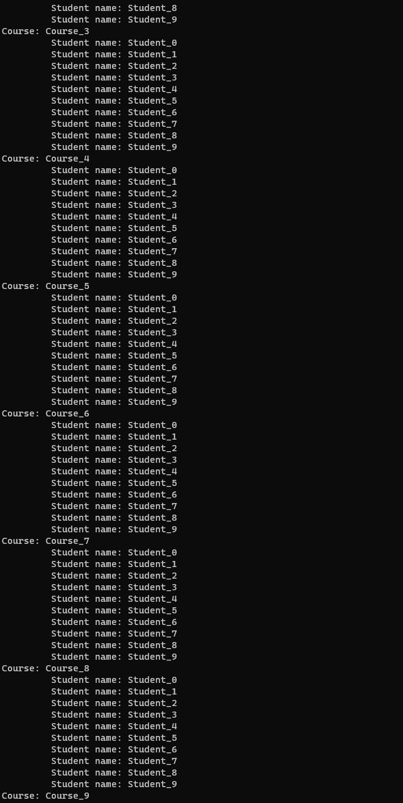

# Module 2: Querying and Manipulating Data Using Entity Framework

# Lesson 3: Querying Data

### Demonstration: Using Language-Integrated Query (LINQ) to Entities

- Abrir el proyecto de consola UsingLINQtoEntities en Visual Studio Code 
- Creamos el contexto en el main e inicializamos la BD
- Ejecutar

